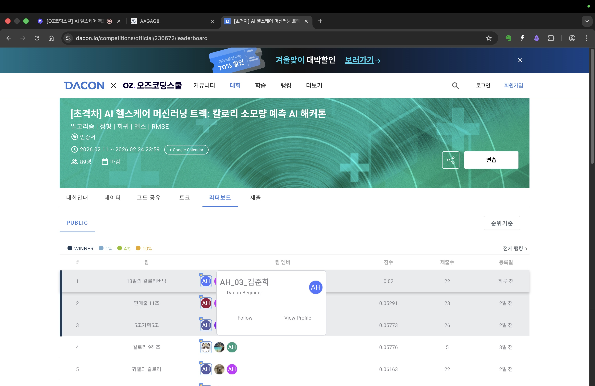

# 🔥 칼로리 소모량 예측 — 역공학으로 데이터 생성 공식 복원

> **"RMSE 0.02, 리더보드 1위"는 표면일 뿐입니다.**
> 진짜 성과는 트리 모델이 못 넘는 벽 앞에서 *"이 데이터는 수식으로 생성된 것 아닌가?"*를 의심하고,
> **역공학으로 생성 공식(Keytel)과 숨은 단위 버그(lb)까지 복원**한 것입니다.

| 역할 | 대회 · 맥락 | 기간 | 성과 |
|---|---|---|---|
| **팀장 (3명, 13조)** | AI 헬스케어 ML 해커톤 | 2026.02 | 리더보드 1위 (비공식) · RMSE ~0.7 → 0.02 |

> **TL;DR** 트리 모델(CatBoost)로 RMSE ~0.7 정체 → 데이터 생성 메커니즘을 의심 → Keytel(2005) 칼로리 소모 공식과 체중 단위 버그(정수 kg이 lb로 저장)를 역공학으로 복원 → 공식 직접 적용으로 RMSE 0.02(기수 내 리더보드 1위, 비공식) 달성.

---

## 1. 문제 (Problem)

운동 기록(심박수·체온·키·체중·성별·나이·운동시간)으로 **소모 칼로리(`Calories_Burned`)를 예측**하는 회귀 문제입니다.

- 데이터: `train.csv` (7,500 × 11), `test.csv` (7,500 × 10)
- 피처: `Exercise_Duration`, `BPM`, `Body_Temperature(F)`, `Weight(lb)`, `Height`, `Gender`, `Age`, …
- 평가: RMSE (낮을수록 우수)

**막힌 지점**: CatBoost를 Feature Engineering + Optuna로 최적화해도 RMSE는 **~0.7에서 정체**. "다른 수강생들은 0.1 이하"라는 단서가, 모델이 아니라 **데이터 자체**를 의심하게 만든 출발점이었습니다.

---

## 2. 접근 (Approach) — 5단계 역공학

> 핵심 전환: *"모델을 더 돌리지 말고, 이 데이터가 어떻게 생성되었는지를 의심하자."*

| 단계 | 발견 | 방법 |
|---|---|---|
| **1** | 데이터가 **100% 결정론적** (같은 피처 → 항상 같은 칼로리) | `groupby(features).std()` → 불일치 **0개** / 고유 조합 7,499 |
| **2** | 칼로리가 **모두 정수** (1~300) | `Calories_Burned % 1 == 0` → 소수점 0개 |
| **3** | `Weight(lb)` 고유값 **간격이 2.2 lb** | 고유값 88개 중 81개 간격 = 2.2 lb = **1 kg 단위** |
| **4** | **Keytel(2005) 공식**의 BPM·Age 계수가 회귀 추정치와 일치 | `LinearRegression`으로 성별별 계수 추정 → Keytel/4.184와 비교 (차이 ~1e-4) |
| **5** | **Weight 계수만 어긋남 → 단위 버그 규명** | 체중이 정수 kg인데 **lb로 저장**됨을 역추적, 그리드 서치로 보정 |

**숨은 단위 버그의 정체**

```
Keytel 원본:  0.1988 / kg
이 데이터:    0.1988 / 4.184 ÷ 2.20462 ≈ 0.02160 / lb-unit   (정수 kg을 lb로 저장)
→ 복원:       W_kg_int = round(Weight(lb) / 2.20462)
```

**복원된 최종 공식**

```
Male:    Cal = round((0.15079×BPM + 0.02160×W_kg_int + 0.04821×Age − 13.168) × Duration)
Female:  Cal = round((0.10688×BPM − 0.01372×W_kg_int + 0.01769×Age −  4.876) × Duration)
```

---

## 3. 핵심 성과 (Results)



- **Train 정확률 100% (7,500/7,500)** · 반올림 RMSE **0.0000** — 생성 공식을 완벽 복원.
- **RMSE ~0.7 → 0.1 → 0.02**로 단계적 돌파, 기수 내 프로젝트 리더보드 **1위** *(대외 공식 수상 아님)*.
- **first-principles 사고의 교과서적 사례** — *"CatBoost는 트리로 f(X)를 근사, 선형회귀는 직선으로 근사, 역공학은 데이터가 알려주는 진짜 f(X)를 그대로 쓴다."* 결론은 **"데이터 특성에 맞는 모델(접근) 선정"**.
- 트리 모델의 한계를 모델 튜닝이 아니라 **데이터 생성 메커니즘 진단**으로 돌파한 점이 면접 포인트.

---

## 4. 기술 스택 (Tech Stack)

- **베이스라인(정체 구간)**: `CatBoost` · `XGBoost` · `LightGBM` + `Optuna` 튜닝 + `SHAP` 기반 Feature Selection
- **역공학(돌파)**: `LinearRegression`(계수 검증) · Grid Search(Weight 계수 탐색) · 단위 환산(lb→kg)·타깃 정수화
- **공통**: `pandas` · `numpy` · `matplotlib` · OOF(K-Fold) RMSE 평가

---

## 5. 재현 방법 (Reproduce)

```bash
# 1) 의존성
pip install pandas numpy scikit-learn matplotlib koreanize_matplotlib

# 2) 데이터 배치 (대회 제공 train.csv / test.csv)
#    노트북 상단 BASE 경로를 본인 환경에 맞게 수정

# 3) 실행: 노트북을 순차 실행
#    [Perfect]Regressor_260222_Keytel_IntKg.ipynb
#    → submit_260222_Perfect_Keytel_rounded.csv 생성 (제출 권장본)
```

| 파일 | 설명 |
|---|---|
| `[Perfect]Regressor_260222_Keytel_IntKg.ipynb` | 최종 역공학 솔루션 (5단계 발견 → 공식 복원 → 제출 생성) |
| `presentation.pdf` | 발표자료 (13조 "13일의 칼로리 버닝조") |

> ⚠️ 공개 전 점검: 노트북의 `BASE` 절대경로(개인 폴더)는 상대경로로 교체, 대회 데이터는 재배포 규정 확인 후 다운로드 안내로 대체.

---

## 6. 회고 · 한계 (Retrospective & Limitations)

- **역공학 접근의 일반화 한계**: 이 솔루션은 데이터가 수식으로 생성된 합성 데이터였기 때문에 가능했다. 실제 임상·IoT 센서 데이터처럼 측정 오차·개인 편차가 섞인 데이터에는 이 방법이 그대로 적용되지 않는다.
- **"1위"는 비공식 기수 내 순위**: 공개 리더보드 또는 대외 수상이 아니며, 같은 기수 수강생 간 비공개 비교 결과다. 과대 표현에 주의.
- **단위 버그 발견의 우연성**: Weight 계수 불일치를 발견한 것은 계수 추정 후 Keytel 논문과 수치 비교라는 체계적 과정이었지만, "이 데이터가 합성일 것"이라는 초기 의심 자체는 다른 수강생 점수라는 외부 단서에서 시작됐다. 맥락 없이 투입됐다면 발견하기 어려웠을 수 있다.
- **재현 가능성 제한**: 노트북 내 `BASE` 절대경로와 대회 데이터(`.csv`)가 공개 불가 상태이므로, 현재 그대로 클론해서 실행하면 경로 오류가 발생한다. 재현을 위해서는 경로 수정 + 데이터 직접 확보가 필요하다.

---

📊 발표자료: [presentation.pdf](presentation.pdf)
🔒 데이터 사용 안내: 대회 데이터는 .gitignore로 제외 (공유 금지)
